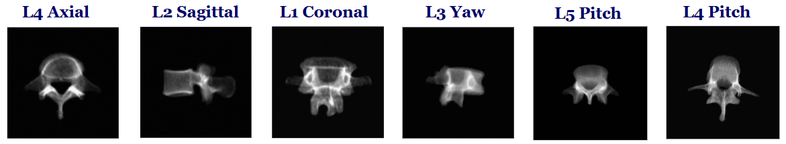
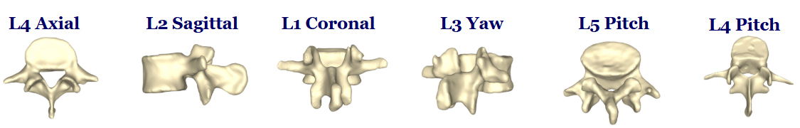
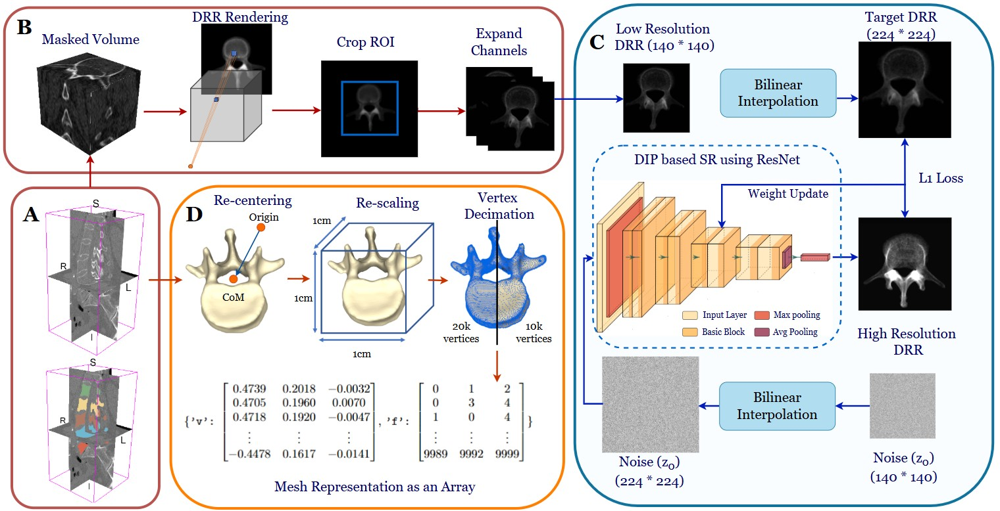

<h1 align="center">Rad-Surf: Automated Synthesis of Radiographs and Vertebral Surfaces for Single-View Reconstruction
</h1>

<p  align="center">  

---

**Rad-Surf** is an automated pipeline designed for single-view 3D vertebra reconstruction in Minimally Invasive Spine Surgery (MISS), where only 2D radiographs are available intraoperatively. Unlike existing datasets that lack paired radiograph–surface data, Rad-Surf generates high-quality Digitally Reconstructed Radiographs (DRRs), point clouds, and surface meshes from CT–segmentation pairs. The dataset is made open source and designed to support robust models.[RadSurf-Dataset](https://drive.google.com/drive/folders/1YBzQlRE8mZOfmKDpoc9omabz6GCIIJbH?usp=sharing) 

<h3 > <i>Index Terms</i> </h3> 

  :diamond_shape_with_a_dot_inside: Minimally Invasive Spine Surgery (MISS)
  :diamond_shape_with_a_dot_inside: Single view Surface Reconstruction(SVR)
  :diamond_shape_with_a_dot_inside: Digitally Reconstructed Radiograph (DRR) 
  :diamond_shape_with_a_dot_inside: Deep Image Prior (DIP)
  :diamond_shape_with_a_dot_inside: Dataset Generation 
  :diamond_shape_with_a_dot_inside: Clinical Validation

</div>

</div>
</details>

<h2 align="center">Dataset</h2>

<details>
<summary><b>Rad-Surf Dataset Overview</b></summary>

The **Rad-Surf** dataset for lumbar vertebrae single-view reconstruction includes:  
- **475 unique DRR–mesh pairs**  
- **24 DRRs per mesh**  
- **Total: 11,400 DRR–mesh pairs**  


You can download the dataset from the following link:

🔗 [RadSurf-Dataset](https://drive.google.com/drive/folders/1YBzQlRE8mZOfmKDpoc9omabz6GCIIJbH?usp=sharing) 
</details>
<details>
<summary><b>Generated DRRs</b></summary>

<p align="center">
  
</p>

<div align="center">
  Example of  DRRs generated from CT and segmentation using 3D Slicer.
</div>

<details>
<summary><b>Generated Meshes</b></summary>

<p align="center">
  
</p>

<div align="center">
  Example of surface meshes generated from CT and segmentation using 3D Slicer.
</div>

</details>

</details>

## <div align="center">Methodology</div>

<p align="center">
  
</p>
<div align = "center">

:small_orange_diamond: Overview of the Rad-Surf Algorithm: (A) Input CT scan and corresponding segmentation label, (B) DRR rendering and preparation, (C) DRR enhancement using
DIP-based super-resolution, and (D) Mesh rendering and post-processing 
</div>

## <div align="center">Implementation Details</div>

<details>
<summary><b>1. DRR Generation</b></summary>
DRRs are synthesized from CT volumes. The CTs with the corresponding segmentation labels should be as follows:
  
```bash
VerSe/
├── verse004/
│ ├── ct.nii.gz # CT volume
│ └── segmentation.nii.gz # Corresponding vertebra mask
├── verse005/
│ ├── ct.nii.gz
│ └── segmentation.nii.gz
```
To render the DRRs, this command can be called:

```bash
RadSurf/
└── DRR_Generation/
    ├── 1_Mask_volume.py      # Applies segmentation masking
    ├── 2_Render_DRR.py       # Uses 3D Slicer to render DRRs
    └── 3_Capture_DRR.py      # Saves projected DRRs
```

</details>


</details>

<details>
<summary><b>2. Mesh Generation </b></summary>


</details>


